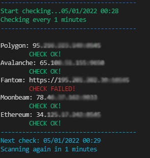
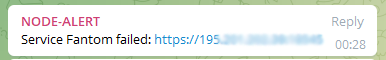

# Axelar RPC Check
With this tool you can input your external_chain RPC endpoints and have the script check for their connectivity or sync status, and notify you in case of a failure.

## Available Features
- RPC Endpoint Check
- Custom Timing
- Telegram Notifications

## Installation

### 1. Install tmux
If you have tmux installed, then you can skip this step. 
```
apt install tmux
```

### 2. Start new session 
```
tmux new -s rpc
```

### 3. Start the script
```
wget https://raw.githubusercontent.com/qubelabsio/axelar-tools/main/rpc.sh
chmod +x rpc.sh
./rpc.sh
```

Once the script starts, follow the instructions and enter your RPC details (IP:PORT or URL), minutes (default 5) and Telegram token (optional).






